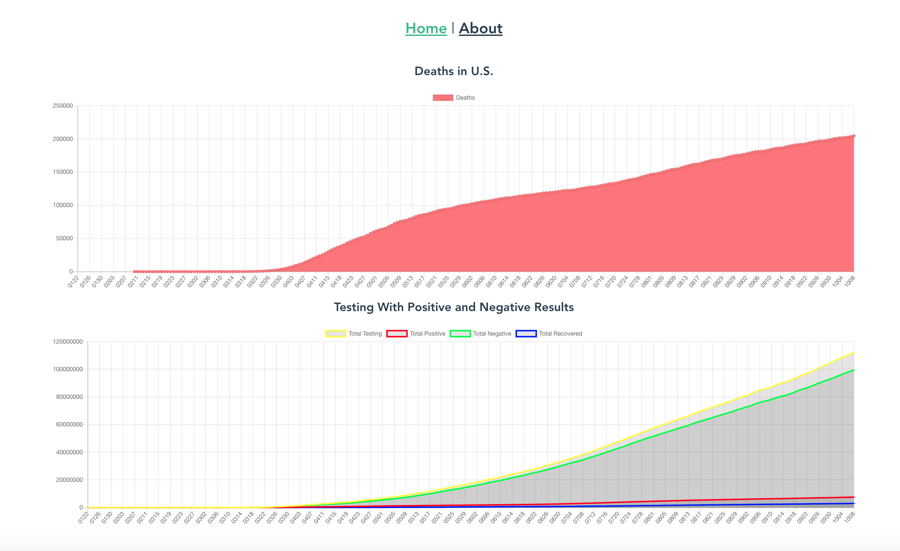

# Vue COVID Tracker



## About

This project was built using Vue.js, Vue CLI, and Chart.js. Data used is being retrieved from https://covidtracking.com/.

Stay safe. Wear a mask. Help stop the spread of the virus.

## Project setup
```
npm install
```

### Compiles and hot-reloads for development
```
npm run serve
```

### Compiles and minifies for production
```
npm run build
```

### Lints and fixes files
```
npm run lint
```

### Customize configuration
See [Configuration Reference](https://cli.vuejs.org/config/).
